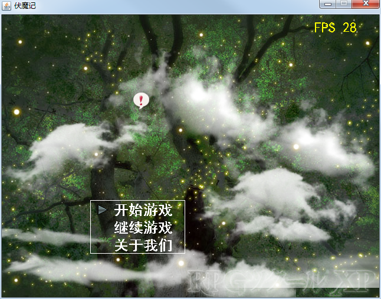
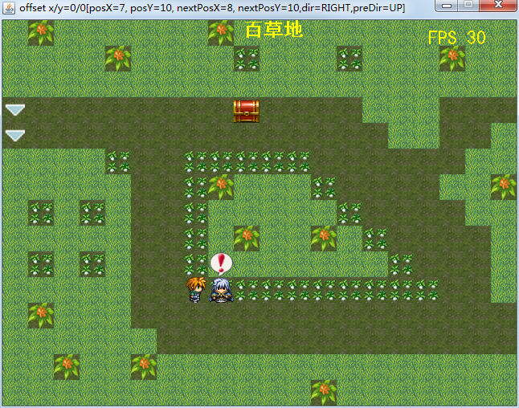
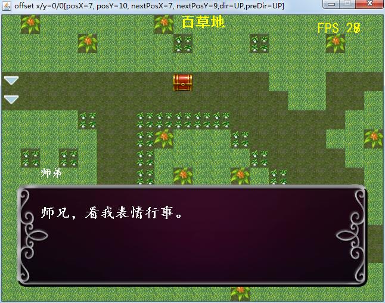

# rpg-one 说明

`rpg-one` 是一个使用纯Java语言编写的一个游戏（或称引擎，因为它的设计目标就是作为一个工具生成游戏而不仅仅是作为游戏），辅以apache工具包。附上几张截图：

工程名本想叫成rpg-in-one，当时没想到这个名称。

## 伏魔

[起因皆伏魔](http://eblog.doyourealizethattheimportantisdifficult.cn/article/detail/41 "起因皆伏魔")

### 运行

现在可通过两种方式运行：
 * 有开发环境：去/rpg-game/src/main/java/billy.rpg.game.GameFrame运行；
 * 无开发环境：去/目录下，双击assembly.bat打包，然后去/rpg-game/target/dist/rpg-game下，双击start.bat即可；

### 启动不了？

- 若是缺少com.billy.thirdparty:resource-filter相关jar包，就去https://gitee.com/valuetodays/thirdparty-aggregation.git下载并打包即可（本问题不会再出现）。
- 若是找不到org.mapeditor:libtiled:1.0-SNAPSHOT，请将/docs/tiled-java.zip解压并按README操作即可。

### 感谢

这个项目前前后后已有五年（今天是2020-10-09），途中我也是半瓶水晃荡，想起来就写，想不起来就不写。
 * 感谢通宵虫、南方小鬼，带我步入了BBK伏魔记的世界；
 * 感谢大学时期初学BBK a系列rpg时众ys168.com网友的帮助，如下但不限于：孤鹰、wstjb、魔术诗y、仙剑忆梦、TAD、刘立等等；
 * 感谢<https://tieba.baidu.com/p/3486103297?red_tag=1343241348>提供的Stack<BaseScreen>的思路；
 * 感谢我爸妈高一时花450元给我买了bbk 4988；
 * 感谢rpg maker xp 和 rpg maker vx，我老是拿它和bbk a rpg开发包作对比；
 * 感觉Soulframe及其雨血，此真是艺术品级游戏！
 * 感谢internet；
 * ...
 * 感谢天，感谢地，感谢命运……

---

### 开发相关

#### 模块说明

| 模块名称  | 说明 | 备注 | 
| --- | --- | --- |  
| rpg-common  | 公共模块  |  |  
| rpg-core  | 核心模块  |  |
| rpg-thirdparty  | 第三方代码  | | 
| rpg-game  | pc端运行入口  |  |
| ~~rpg-android~~  | android端运行入口  | 已舍弃 | 
| rpg-tools  | 工具类  |  |
| rpg-rb2demo  | 雨血2demo的资源使用示例（横版）  | 暂与游戏无关 | 
| rpg-standalone | java3d相关  | 暂本游戏无关 |

#### 测试及覆盖率

    mvn clean package -DskipTests=false
    mvn sonar:sonar -Dsonar.host.url=http://s204:9000

#### 提交规范

message: type: xxxx

type: docs/test/feature/opt/refactor

#### 版本升级

`mvn versions:set -DnewVersion=新版本-SNAPSHOT`

#### 更新历史

 见[更新历史](./HISTORY.md)