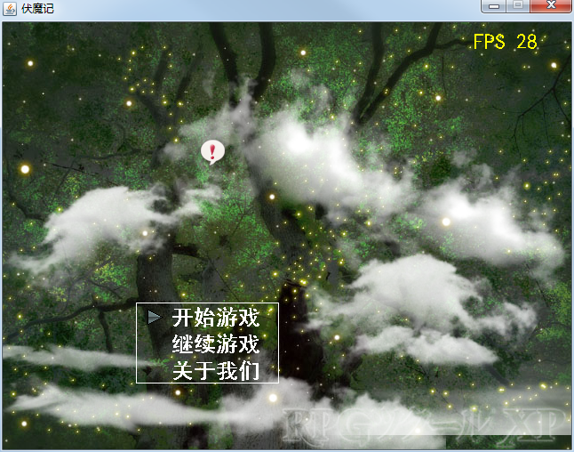
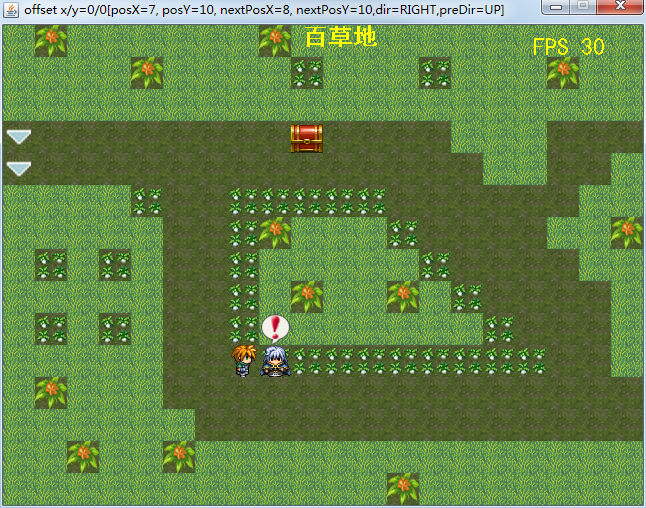
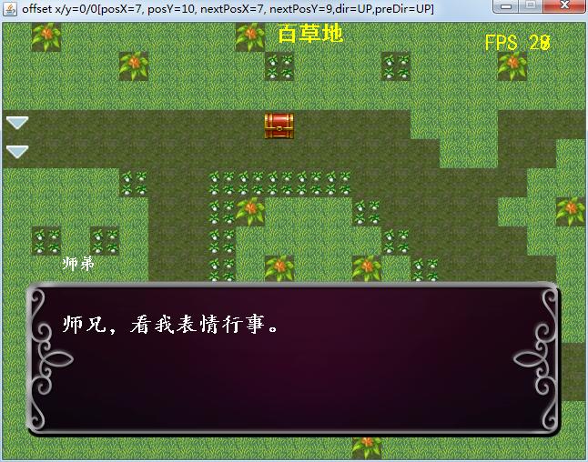

**中文** | [English](./README.md)

#### 

[起因皆伏魔](http://eblog.doyourealizethattheimportantisdifficult.cn/article/getDetail.do?id=41 "起因皆伏魔")

#### 说明

`rpg-game` 是一个使用纯Java语言编写的一个游戏（或称引擎，因为它的设计目标就是作为一个工具生成游戏而不仅仅是作为游戏），辅以apache工具包。附上几张截图：

#### 运行

现在可通过两种方式运行：
 * 有开发环境：去/rpg-game/src/main/java/billy.rpg.game.GameFrame运行；
 * 无开发环境：去/目录下，双击assembly.bat打包，然后去/rpg-game/target/dist/rpg-game下，双击start.bat即可；

#### 感谢

这个项目前前后后已有三年，途中我也是半瓶水晃荡，想起来就写，想不起来就不写，不过还好一直都在坚持。
 * 感谢通宵虫、南方小鬼，带我步入了BBK伏魔记的世界。
 * 感谢大学时期初学BBK a系列rpg时众ys168.com网友的帮助，如下但不限于：孤鹰、wstjb、魔术诗y、仙剑忆梦、TAD、刘立等等；
 * 感谢https://tieba.baidu.com/p/3486103297?red_tag=1343241348提供的Stack<BaseScreen>的思路
 * 感谢我爸妈高一时花450元给我买了bbk 4988；
 * 感谢rpg maker xp 和 rpg maker vx，我老是拿它和bbk a rpg开发包作对比；
 * 感觉Soulframe及其雨血，此真是艺术品级游戏！
 * 感谢internet；
 * ...
 * 感谢天，感谢地，感谢命运……

#### 更新历史

 见[更新历史](./HISTORY.md)
    