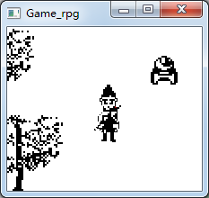

**中文** | [English](./README.md)

#### 起因皆伏魔

你玩过步步高电子词典上的`伏魔记`吗？我高中时玩过，且一直难以忘情。大学时学习了C和Win32，所以就自己做了个Win32版本的伏魔记（但只有简单的一个地图，地图上有个柳清风，可以上下左右走动，完了）。附上一个简单截图：



（我能附上截图，是因为有保留有源代码：代码在
[https://gitee.com/valuetodays/ellen/tree/master/py-c-vc-walker/rearrange-on-20180804/c-all/c-when-college/fmj](https://gitee.com/valuetodays/ellen/tree/master/py-c-vc-walker/rearrange-on-20180804/c-all/c-when-college/fmj)，其中的fmj_1st.zip就是。

在2015年有个冲动自己使用C语言实现java的String类（ADT，abstract data type），只写了一小部分，最终没有坚持下来。自己实现String类的原因是想使用c写一个伏魔记，后来为了省事就使用了java，最早时该项目名叫scriptParser（后来学习maven，就把scriptParser整理成maven版的了，即[scriptParser-mvn](https://github.com/billysAnna/scriptParser-mvn)，但是scriptParser在github上已经找不到了），托管在github上，我的网络是每月50元、可是只有1M的网（真想说句f**k），使用git push老是失败，我就改用了现在的码云[gitee.com](gitee.com)，当时域名还是[git.oschina.net](git.oschina.net)呢。

代码转过来时名称还是script-parser，项目如其名，只是为了解析类似步步高伏魔记的脚本文件，当时做的是cui(console-user-interface)模式（即在控制台用户界面）的，后来整理成了gui(graphical-user-interface)模式（即图形用户界面），相应地，script-parser也就改名成了rpg，因为使用maven，没有想到项目名要使用rpg-parent，就使用了rpg-one这个有难以理解的名称（以后再改吧），下面附上一段伏魔记经典片段

```text
@开始游戏
SHOWGUT 1 0 "引：                 天地玄黄，宇宙洪荒  自古道魔不两立，    世虽以道为正，道魔  之争却从未休止。    究其因，何以道正而  魔始未灭，          属正邪者，心也！    正所谓：             道非道，魔非魔      善恶在人心！                            江湖中有耳朵的人，绝无一人没有听见过“无机道长”这人的名字，江湖中有眼睛的人，也绝无一人不想瞧瞧“无机道长”绝世风采和他的绝代神功。        只因为任何人都知道，世上绝没有一个少女能抵挡“无机道长”的微微一笑，也绝没有一个英雄能抵挡“无机道长”的轻轻一剑！      任何人都相信，“无机道长”的剑非但能在百万军中取主帅之首级，也能将一根头发分成两根，而他的笑，却可令少女的心碎。        3月28日晚，无机和 当时危害人间的大魔头——赤血天魔依约在三清山的伏魔洞前进行生死决斗。              决斗后，无机负伤而归，赤血天魔不知所终。决斗结果无人知晓。  二十年后……                                                                                      "
loadmap 1 2 15 0   
MOVIE 1 2 0 0 2
CREATEACTOR 1 4 3
NPCSTEP 0 0 1
say 1 "小蝴蝶，不要跑……"
NPCSTEP 0 1 1
say 1 "小蝴蝶，不要跑……"
NPCSTEP 0 2 1
say 1 "小蝴蝶，快出来……"
NPCSTEP 0 3 1
say 1 "小蝴蝶……,哪去了？？"
CREATENPC 1 2 17 6
MOVE 1 17 3
MOVE 1 18 3
say 0 "师兄，原来你在这啊，师父找不到你，正在无机阁大发雷霆呢，你快点到无机阁见师傅吧。"
say 1 "好，你先走，我就去。"
MOVE 1 17 3
MOVE 1 17 6
DELETENPC 1
NPCSTEP 0 0 1
NPCSTEP 0 1 1
NPCSTEP 0 2 1
NPCSTEP 0 3 1
say 1 "咦，我的小蝴蝶哪去了？？"
say 1 "还是先去见师父吧。"
setevent 1
SETMONEY 500
```

再来一段script-parser能解析的脚本：

```text
attr 1 1
scenename '百草地'
monsters 51
battleImage "001-Grassland01.jpg"

createtransfer 201 0 4
createtransfer 201 0 3

playbgm
emotion 0 5
say 1 '柳清风' LEFT '小蝴蝶，不要跑……'
npcstep 0 UP 1
@animation 3 50 100
say 1 '柳清风' RIGHT '小蝴蝶，不要跑……'
npcstep 0 LEFT 1
say 1 '柳清风' LEFT '小蝴蝶，快出来……'
npcstep 0 RIGHT 1
say 1 '柳清风' LEFT '小蝴蝶，不要跑……'
npcstep 0 DOWN 1
say 1 '柳清风' LEFT '小蝴蝶……，哪去了？？'
npcstep 0 UP 1
```

其实大同小异。

#### 说明

`rpg-game` 是一个使用纯Java语言编写的一个游戏（或称引擎，因为它的设计目标就是作为一个工具生成游戏而不仅仅是作为游戏），辅以apache工具包。附上几张截图：


现在可通过两种方式运行：
 * 有开发环境：去/rpg-game/src/main/java/billy.rpg.game.GameFrame运行；
 * 无开发环境：去/目录下，双击assembly.bat打包，然后去/rpg-game/target/dist/rpg-game下，双击start.bat即可；

#### 感谢

这个项目前前后后已有三年，途中我也是半瓶水晃荡，想起来就写，想不起来就不写，不过还好一直都在坚持。
 * 感谢通宵虫、南方小鬼，带我步入了BBK伏魔记的世界。
 * 感谢大学时期初学BBK a系列rpg时众ys168.com网友的帮助，如下但不限于：孤鹰、wstjb、魔术诗y、仙剑忆梦、TAD、刘立等等；
 * 感觉Soulframe及其雨血，此真是艺术品级游戏！
 * 感谢rpg maker xp 和 rpg maker vx，我老是拿它和bbk a rpg开发包作对比；
 * 感谢我爸妈高一时花450元给我买了bbk 4988；
 * 感谢internet；
 * ...
 * 感谢天，感谢地，感谢命运……

#### 更新记录

#### 2015-09-16

execute the method `com.billy.rpg.game.scriptParser.ScriptParser#main()` to show ...

#### 2016-05-11 
add `bbk a rpg` development tools in `docs/`


#### 2016-11-30
ILoader 
    IResourceLoader  IMapResourceLoader IScriptResourceLoader 
    IItemLoader

#### 2016-12-07 tag1.0
    Now game is runnable by ui( and console), with script/map/tile/role to controller movement of player(a tree stock).
    next is to set unwalkable tile, show dialog, etc....
    
    execute the method `com.billyrupeng.Main.main(String[])` to show by ui
    

#### 2016-12-08 tag1.1
    show unwalkable tile, bgLayer and npcLayer of map, npc.
    
    
     
#### 2017-01-09 16:35
    show dialog with colorful text

     
#### 2017-05-18 18:29
    add head pic in dialog
    
#### 2017-07-07 13:10
    show animation 

#### 2017-07-20 13:20
    meet monster and begin battle. 
    make monster's attack action
    ESC in chooseMonsterScreen and optionScreen
    造成伤害时要显示血量减少
    [普通攻击时，攻击者应移动至目标处，再进行攻击，应有动画]
    对话要能有先后
    指定发生战斗的命令
    可供选择的选择框 choicecmd
    
#### 2017-07-24 11:30
    virtualtable要分情况 全局有效 or 本script文件有效
    [TODO]布尔型变量 or 整数型变量 （布尔型变量用于事件判断，整数可用于ifcmpt/decrease/increase等）
    [TODO] set/unset, use boolean[1024] not map in virtualtable，但是只能使用数字不能使用字符串了，得重新考虑
    showtext/say 要提供选择头像在左/右/无
    
#### 2017-08-22 17:17
    完成滚屏，且处理当地图宽20高15时hero去不了右，下，右下这三个象限的问题
    add npcId argument to the command `createnpc`, and 0 means no event to this npc
    对同一地图中多个宝箱的操作
    BaseCharacter中的height与width已删除
    将talk命令与trigger命令合并成trigger命令，map的坐标事件改由事件触发
    处理地图编辑器中添加npc时的npcId问题，npc层的一个整数的前16位代表npcId,后16位代表tileNum.
  
#### 2017-08-28 17:37
    修复战斗中玩家将多个妖怪中的第一个妖怪kill后，战斗停止的情况
    修正了战斗中攻击者会向被攻击者移动的情况
    
#### 2017-08-29 17:39
    调低了051号小怪的攻击力和和生命值。这样一下遇到三个小怪也不会被一波带走了，同样，玩家一级时也不能秒死051号小怪了
    [TODO]在角色编辑器中添加一个技能触发率，越大表示使用技能的可能性越大
    [TODO]战斗中使用技能攻击 & 技能列表显示 & 技能链
    [TODO]唯一被动 张飞攻击必暴击，刘备有一定机率使受到的伤害降为1
    
#### 2017-08-28 17:39
    [TODO]角色编辑器中添加技能列表，妖怪级别不会升

### 2017-09-05 11:07
    increasemoney decreasemoney命令完成
    increasegoods decreasegoods命令
    GoodsScreen
    [TODO]命令testmoney
    
### 2017-11-28 14:50
    BaseCharacter:
    curFrame;  // 步数 0右，1停止，2左
    direction; // 方向 0下，1左，2右，3上
    add command: move, npcstep, deletenpc
   
### 2017-12-21 13:50
    set的参数中，全是数字就表示是全局变量，其它的全是局部变量，局部变量只在script内有效
    
    
#### 2018-01-13 18:16
    from https://www.cnblogs.com/mq0036/p/4026057.html
    
    
#### 2018-09-27
    use jline to parse command,  not if-elseif-elseif-... but File#listFiles()
    
#### 2018-09-28
    ShowText -> SayCmd
    脚本内容过长时（如say/showgut）以\来接续下一行
    extract dialogTextFormatter
    add createtransferCmd
    show goods list
    show shop ui and buy goods


#### 2018-09-29
    IncreaseGoodsCmd -> AddGoodsCmd;  DecreaseGoodsCmd -> UseGoodsCmd
    IncreaseMoneyCmd -> AddMoneyCmd;DecreaseMoneyCmd -> UseMoneyCmd
    NPCSTEP/move use LEFT/RIGHT/UP/DOWN not 1/2/3/4
    add parser/processor package 
    [TODO] existnpc npcId

#### 2018-10-03
    骨骼系统，栩栩如生：角色图像运用Spine 2D骨骼技巧呈现，随风飘逸的发丝、栩栩如生的动态彷佛角色跃然于屏幕之上，活灵活现
    command : equip xx[roleId] yy[goodsId]
    已可装备武器，计算伤害时，将武器的效果附带上
    
#### 2018-10-16
    将*.map的二进制文件转换成json文件，方便使用
    使用Tiled来创建地图 （见2018-11-14）
    
#### 2018-11-03
    设置 -> 系统 -> 显示装备
    use  SwingUtilities.invokeLater to start game
    user GameFrame.createAndShowGUI()
#### 2018-11-05
    可在行走图中吃药
    [TODO]战斗中使用药物?
#### 2018-11-08
    装备鞋子功能添加
    图像放大与缩小
    TODO 图像旋转
    文本工具类，用于显示“攻击力：100(+23)”的中+23是彩色的情况，用于个人属性查看
    https://www.java.com/en/java_in_action/alice.jsp

#### 2018-11-10
    完成 100(+23)的中+23是彩色的情况，用于个人属性查看
    显示神龙护体特效
    添加rmvx sword4 特技，但使用ps切片保存后的图片背景不透明了
    
#### 2018-11-12
    使用程序分割rmvx的图片
    json格式的动画文件的扩展名为.jani
    [TODO] 使用渐变矩形画hp/mp/exp属性
    神龙护体特效的背景色有问题
    HeroCharacter和MonsterCharacter【是一个】Fighable！
#### 2018-11-14
    https://github.com/bjorn/tiled/tree/master/util/java/libtiled-java的bug：地图文件在/map目录下，图块在/tile目录下，tsx文件也在/tile目录下，一个map文件关联到../tile/1.tsx，但这个map在读取tsx关联和png文件里，却是从/map目录取而非tsx的相对目录。
    使用Tiled来创建地图，但是地图层只保留两层：bgLayer和walkLayer；同时原有的MapEditor已无效了。^\_^|||
    使用Freemarker转换bbk a rpg地图数据 -> 原地图数据 -> TMX
    地图只用于显示地图和行走层，不用于控制传送门和npc和宝箱，因为使用了TMX
#### 2018-11-15
    测试acp命令   git add . && git commit -m $1 && git push
    Q键切换大地图上的玩家人设， 接收不了Tab按键消息

#### 2018-11-16
    提取出rpg-core，供rpg-android和rpg-game使用
    整理rpg-core的依赖，N行代码被改动！！！（看来刚开始的设计不是很好）

#### 2018-11-19
    离开地图后应清空传送门、npc、宝箱
    添加创建宝箱命令CreateChestCmd、打开宝箱命令OpenChestCmd
    添加BuiltinScriptItem、builtin.s、部分重复标签以便复用
    显示场景物品如三清宫
    [TODO] 切换场景再回来后发现宝箱还是关闭着的，但是已经不能再打开了
   
#### 2018-11-20
    the f**king gradle: work differently with the same version idea-community(v2018.2.5), the same gradle version(v4.10.2), and the same OS(Windows7), go back to use maven instead.
    使用ScreenCodeEnum
    完善并删除部分TODO
    add BattleImageCmd [从/battle/目录下取资源，默认为deafult_battle.jpg]
    解决了一个很早就就出现但久未解决的bug：在大地图上显示say/messagebox命令后，窗口会一闪而过，试着把MessageBoxScreen#onKeyUp()的内容移到了MessageBoxScreen.onKeyDown()中，问题解决了。感觉框架上缺少一个消费按键消息的功能。
    [TODO]资源文件的定时扫描加载?
    普通攻击时取攻击者和目标的矩形的中心，攻击即是让两个中心重合
    人物战斗图只有一帧，攻击时该帧向目标发起攻击 [TODO 玩家或怪物被攻击时，有格挡帧/挨打帧]
    修正：怪物攻击玩家时，怪物的贴图应该在玩家上面

#### 2018-11-21
    处理升级逻辑
    显示升到下一级所需要的经验值
    添加命令HasMoneyCmd，用于检验是否有足够的金钱
#### 2018-11-22
    添加buff功能，但是此功能确实复杂，先简单实现
    战斗中应该使用角色本身属性+buff属性+装备属性
    改名：HasEquipCmd/HasMoneyCmd -> IfEquipCmd/IfMoneyCmd
    添加普攻的群攻与单攻效果
#### 2018-11-25
    添加EmotionCmd命令，人物可以有表情了。

#### 2018-11-28
    打包成可运行环境：
     * 先在/目录下执行`mvn clean install -DskipTests`；
     * 再去/rpg-game/目录下执行`mvn clean package -DskipTests assembly:single`打包rpg-game，（同时把/rpg-common/src/main/resources/assets的资源复制到dist/rpg-game/目录，配置见rpg-game/assembly.xml）；
     * 注意，需要排除/rpg-common/src/main/resources/assets资源目录，不然会生成多余的一份资源数据，（见/rpg-common/pom.xml的配置）；

    现在可通过两种方式运行，
     * 有开发环境：去/rpg-game/src/main/java/billy.rpg.game.GameFrame运行；
     * 无开发环境：去/目录下，双击assembly.bat打包，然后去/rpg-game/target/dist/rpg-game下，双击start.bat即可；

#### 2018-11-29
    添加LevelUpCmd，用于强制升级，（区别于靠打怪升级不同）

#### 2018-12-03
    成就：钨龙剑，第一滴血，伏魔

#### 2018-12-06
    buff互斥：则buff取消
    buff叠加：后者取代前者 （不管前者持续回合是否比后者长）
    防御力基本buff添加完毕
    速度基本buff添加完毕
    提取两大抽象Buff类: FixedValueBuff, PercentValueBuff
    微调封面的雾的位置
    物品中添加effectType来使用武器有群攻与单攻之分；
    添加screenshot命令